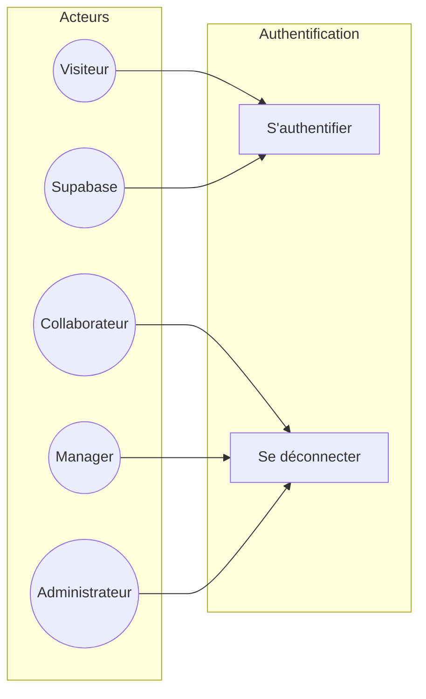
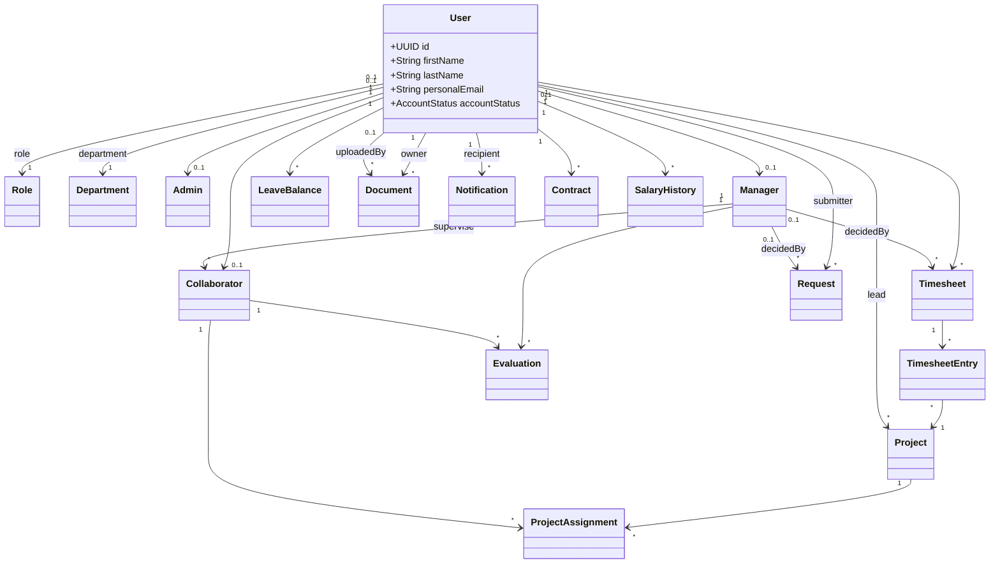

# CONCEPTION UML — Plateforme RHpro (Attendance Workflow)

*Document d’architecture logicielle et de modélisation UML, aligné sur le **schéma Prisma** (`backend/prisma/schema.prisma`), les **modules NestJS** et le **front Next.js**. Destiné à la reproduction sous **draw.io** (ou équivalent).*

---

## 0. Légende et correspondance avec le code

| Élément UML | Réalisation dans le projet |
|-------------|---------------------------|
| **Acteurs** | Rôles métier + visiteur ; le contrôle d’accès est assuré par `RolesGuard` et `Role` (enum applicative : Admin, Manager, Collaborator) croisé avec le profil `User` + tables `Admin` / `Manager` / `Collaborator`. |
| **Cas d’utilisation** | Fonctionnalités exposées par l’API REST et/ou l’interface (écrans `app/(dashboard)/…`). |
| **Classes métier** | Modèles Prisma (`schema.prisma`, schéma `public`). |
| **Authentification** | Supabase Auth (JWT) + utilisateur applicatif en base (`User`, `personalEmail` lié au compte). |

**Note importante — profils métier :** en base, **`User`** est l’agrégat identité. Les entités **`Admin`**, **`Manager`**, **`Collaborator`** sont des **extensions 1–1** (même identifiant UUID que `User`), et non une hiérarchie de classes au sens ORM « héritage de table unique ». En UML, on modélise par **associations 1–0..1** plutôt que par héritage `User <|-- Admin`, sauf si vous choisissez une vue conceptuelle par **généralisation d’acteurs** uniquement.

---

# PARTIE A — Diagramme de cas d’utilisation global

## A.1 Acteurs

### A.1.1 Acteur secondaire (système externe)

| Acteur | Description |
|--------|-------------|
| **Système d’authentification (Supabase)** | Fournit connexion par e-mail / mot de passe, rafraîchissement de jeton, flux « mot de passe oublié » / réinitialisation. Interagit avec les cas *S’authentifier*, *Rafraîchir la session*, *Demander la réinitialisation du mot de passe*, *Réinitialiser le mot de passe*. |

### A.1.2 Acteur « Visiteur »

| Acteur | Description |
|--------|-------------|
| **Visiteur** | Utilisateur non connecté (consultation landing, accès pages `/auth/login`, `/auth/forget-password`, `/auth/reset-password`). |

### A.1.3 Généralisation des acteurs métier (recommandée sur draw.io)

Créez un acteur abstrait ou étiqueté **« Utilisateur authentifié »**, puis trois spécialisations :

| Acteur spécialisé | Description | Correspondance code |
|-------------------|-------------|---------------------|
| **Administrateur** | Rôle RH / super-user. | `Role.ADMIN` + ligne `Admin` liée au `User`. |
| **Manager** | Valide temps et demandes de son équipe, saisit des évaluations. | `Role.MANAGER` + ligne `Manager`. |
| **Collaborateur** | Saisit temps, demandes, consulte son dossier. | `Role` collaborateur + ligne `Collaborator` + `managerId`. |

**Remarque :** un même `User` a typiquement **un seul** des profils `Admin` / `Manager` / `Collaborator` selon les règles métier ; le schéma physique autorise théoriquement plusieurs extensions — la contrainte métier peut être indiquée par une **note** UML sur le diagramme de classes.

**Sur draw.io :**  
Utilisez la flèche de **généralisation** (triangle creux) de *Administrateur*, *Manager* et *Collaborateur* vers *Utilisateur authentifié*.

---

## A.2 Liste des cas d’utilisation (à modéliser en ovales)

Les regroupements ci-dessous correspondent à des **paquets (packages)** logiques dans draw.io : `Authentification`, `Utilisateurs & profil`, `Feuilles de temps`, `Projets`, `Demandes & congés`, `Évaluations & salaires`, `Documents`, `Notifications`, `Référentiels`, `Contrats`.

### Paquet — Authentification & session

| ID | Cas d’utilisation | Acteurs principaux | Acteurs secondaires |
|----|-------------------|--------------------|---------------------|
| UC-A01 | **S’authentifier** | Visiteur → devient Utilisateur authentifié | Supabase |
| UC-A02 | **Rafraîchir la session (jeton)** | Utilisateur authentifié | Supabase |
| UC-A03 | **Se déconnecter** | Utilisateur authentifié | Supabase (optionnel) |
| UC-A04 | **Demander la réinitialisation du mot de passe** | Visiteur | Supabase |
| UC-A05 | **Réinitialiser le mot de passe (lien sécurisé)** | Visiteur | Supabase |

**Relations suggérées :**  
- `UC-A01` **⟨include⟩** interaction avec Supabase (si vous modélisez le détail : ovale « Obtenir JWT » lié à Supabase).  
- `UC-A04` **⟨extend⟩** option « e-mail inconnu » (gestion d’erreur) — optionnel.

---

### Paquet — Visite & marketing

| ID | Cas d’utilisation | Acteurs |
|----|-------------------|---------|
| UC-V01 | **Consulter la page d’accueil publique (landing)** | Visiteur |

---

### Paquet — Utilisateurs, dossier RH, hiérarchie

| ID | Cas d’utilisation | Acteurs typiques |
|----|-------------------|------------------|
| UC-U01 | **Consulter la liste des employés** | Administrateur |
| UC-U02 | **Créer un employé (compte + profil)** | Administrateur |
| UC-U03 | **Modifier un employé** | Administrateur ; Manager (selon règles API `updateUser`) ; Collaborateur (champs limités / interdits selon politique) |
| UC-U04 | **Supprimer un employé** | Administrateur |
| UC-U05 | **Modifier le mot de passe d’un employé** | Administrateur |
| UC-U06 | **Consulter le dossier d’un utilisateur (dossier structuré)** | Utilisateur authentifié (soi) ; Administrateur |
| UC-U07 | **Définir ou modifier le manager d’un collaborateur** | Administrateur |
| UC-U08 | **Consulter les collaborateurs supervisés par un manager** | Manager ; Administrateur |
| UC-U09 | **Consulter le manager d’un collaborateur** | Utilisateur authentifié |
| UC-U10 | **Téléverser une photo de profil** | Utilisateur authentifié (soi) ; Administrateur / Manager (pour un autre utilisateur, selon droits API) |
| UC-U11 | **Supprimer la photo de profil** | Idem UC-U10 |
| UC-U12 | **Consulter les rôles référentiels** | Administrateur (configuration UI) |
| UC-U13 | **Consulter les départements** | Administrateur |

---

### Paquet — Feuilles de temps

| ID | Cas d’utilisation | Acteurs |
|----|-------------------|---------|
| UC-T01 | **Créer ou mettre à jour une feuille de temps en brouillon** | Collaborateur (titulaire) |
| UC-T02 | **Soumettre une feuille de temps** | Collaborateur |
| UC-T03 | **Approuver une feuille de temps** | Manager, Administrateur |
| UC-T04 | **Rejeter une feuille de temps** | Manager, Administrateur |
| UC-T05 | **Consulter les feuilles de temps d’un utilisateur** | Utilisateur authentifié (droits selon rôle) |
| UC-T06 | **Consulter les feuilles soumises en attente pour un manager** | Manager, Administrateur |
| UC-T07 | **Consulter le rapport hebdomadaire des heures** | Utilisateur authentifié (contrôlé côté API) |
| UC-T08 | **Consulter le rapport mensuel des heures** | Idem |
| UC-T09 | **Consulter les totaux d’heures par projet (période)** | Administrateur, Manager (selon écrans) |
| UC-T10 | **Exporter des rapports (Excel / PDF)** | Si implémenté dans `TimesheetsController` — à lier aux endpoints réels |

*Le statut métier suit l’énumération `TimesheetStatus` : DRAFT, SUBMITTED, APPROVED, REJECTED.*

---

### Paquet — Projets & affectations

| ID | Cas d’utilisation | Acteurs |
|----|-------------------|---------|
| UC-P01 | **Lister les projets** | Utilisateur authentifié (selon usage front) |
| UC-P02 | **Créer un projet** | Administrateur |
| UC-P03 | **Modifier un projet** | Administrateur |
| UC-P04 | **Supprimer un projet** | Administrateur |
| UC-P05 | **Affecter un collaborateur à un projet** | Administrateur |
| UC-P06 | **Retirer ou clôturer une affectation** | Administrateur |

---

### Paquet — Demandes (congés, augmentation, etc.)

| ID | Cas d’utilisation | Acteurs |
|----|-------------------|---------|
| UC-R01 | **Créer une demande en brouillon** | Collaborateur |
| UC-R02 | **Modifier une demande en brouillon** | Collaborateur |
| UC-R03 | **Soumettre une demande** | Collaborateur |
| UC-R04 | **Approuver une demande** | Manager, Administrateur |
| UC-R05 | **Rejeter une demande** | Manager, Administrateur |
| UC-R06 | **Annuler une demande** | Collaborateur (paramètre `userId`) |
| UC-R07 | **Consulter les demandes d’un utilisateur** | Utilisateur authentifié |
| UC-R08 | **Consulter les demandes en attente pour un manager** | Manager |
| UC-R09 | **Consulter toutes les demandes (vue admin)** | Administrateur |
| UC-R10 | **Mettre à jour le solde de congés d’un utilisateur** | Administrateur |
| UC-R11 | **Consulter / gérer les jours fériés** | Administrateur |

*Statuts : `RequestStatus` ; types : `RequestType` ; pour les congés : `LeaveType`.*

---

### Paquet — Évaluations & historique salarial

| ID | Cas d’utilisation | Acteurs |
|----|-------------------|---------|
| UC-E01 | **Créer une évaluation** | Manager, Administrateur |
| UC-E02 | **Modifier une évaluation** | Idem |
| UC-E03 | **Supprimer une évaluation** | Idem |
| UC-E04 | **Consulter les évaluations d’un collaborateur** | Collaborateur (ses résultats) ; Manager / Admin |
| UC-E05 | **Consulter l’historique salarial d’un utilisateur** | Selon droits (profil dossier / performance) |
| UC-E06 | **Consulter les rapports agrégés performance** | Administrateur, Manager |

---

### Paquet — Documents dossier

| ID | Cas d’utilisation | Acteurs |
|----|-------------------|---------|
| UC-D01 | **Téléverser un document sur le dossier d’un utilisateur** | Typiquement Administrateur |
| UC-D02 | **Lister / filtrer les documents d’un utilisateur** | Utilisateur authentifié (dossier) |
| UC-D03 | **Consulter les versions d’un document** | Idem |
| UC-D04 | **Supprimer un document** | Selon politique (souvent Administrateur) |

*Catégories : `DocumentCategory`.*

---

### Paquet — Notifications

| ID | Cas d’utilisation | Acteurs |
|----|-------------------|---------|
| UC-N01 | **Consulter les notifications reçues** | Utilisateur authentifié |
| UC-N02 | **Marquer une notification comme lue** | Utilisateur authentifié |
| UC-N03 | **Marquer toutes les notifications comme lues** | Utilisateur authentifié |

---

### Paquet — Contrats (cycle de vie RH)

| ID | Cas d’utilisation | Acteurs |
|----|-------------------|---------|
| UC-C01 | **Créer / mettre à jour / consulter les contrats d’un utilisateur** | Selon `contracts.controller` et écrans dossier |

*À raccorder aux endpoints réels du module `contracts`.*

---

### Paquet — Tableaux de bord & analytics (front)

| ID | Cas d’utilisation | Acteurs |
|----|-------------------|---------|
| UC-B01 | **Consulter le tableau de bord (indicateurs agrégés)** | Administrateur, Manager, Collaborateur |
| UC-B02 | **Visualiser graphiques (Recharts) sur statistiques** | Administrateur, Manager |
| UC-B03 | **Consulter l’activité récente (feuilles / demandes)** | Collaborateur (données réelles) |

*Ces cas sont principalement **côté présentation** (agrégation d’appels API).*

---

## A.3 Matrice acteurs × paquets (vue synthèse pour draw.io)

Utilisez cette matrice pour tracer les **associations** (lignes pleines) entre chaque acteur et les cas qui le concernent.

|  | Auth | Visite | Utilisateurs | Timesheets | Projets | Demandes | Évaluations | Documents | Notifications | Contrats | Dashboard |
|--|:----:|:----:|:------------:|:----------:|:-------:|:--------:|:-----------:|:-----------:|:-------------:|:----------:|:---------:|
| Visiteur | ✓ | ✓ |  |  |  |  |  |  |  |  |  |
| Supabase | ✓ |  |  |  |  |  |  |  |  |  |  |
| Collaborateur | ✓ |  | ✓ (soi) | ✓ | lecture | ✓ | ✓ (lecture) | ✓ (lecture) | ✓ | ✓ (lecture) | ✓ |
| Manager | ✓ |  | ✓ (limité) | ✓ (validation) | lecture | ✓ (décision) | ✓ | ✓ (lecture) | ✓ | ✓ | ✓ |
| Administrateur | ✓ |  | ✓ (complet) | ✓ | ✓ | ✓ (complet) | ✓ | ✓ | ✓ | ✓ | ✓ |

---

## A.4 Relations UML entre cas d’utilisation (à ajouter si pertinent)

| Relation | Exemple | Commentaire |
|----------|---------|-------------|
| **⟨include⟩** | `Soumettre une feuille de temps` **include** `Vérifier que la feuille est en brouillon` | Sous-étape obligatoire (facultatif sur le schéma global pour ne pas surcharger). |
| **⟨extend⟩** | `Rejeter une feuille de temps` **extend** `Saisir un motif de rejet` | Conditionnel. |
| **Généralisation UC** | `Approuver une demande` et `Approuver une feuille de temps` peuvent généraliser vers **Approuver un objet soumis** (optionnel, niveau conceptuel). |

---

## A.5 Guide draw.io — diagramme de cas d’utilisation

1. Créer une page « Cas d’utilisation global ».
2. Placer à gauche les **acteurs** : Visiteur, Supabase (acteur secondaire, stéréotype `≪system≫`), puis la généralisation vers **Utilisateur authentifié** et les trois rôles.
3. Dessiner des **paquets** (dossiers UML) nommés comme les sections A.2.
4. Dans chaque paquet, créer les **ovales** (UC-A01, …) avec le libellé en français.
5. Relier par des **associations** continues : acteur ↔ cas.
6. Ajouter **`<<include>>`** / **`<<extend>>`** en pointillés avec stéréotype uniquement si le diagramme reste lisible.
7. Ajouter des **notes** (post-it) pour rappels : contrôle d’accès `RolesGuard`, `Role` enum applicative.

---

## A.6 Diagramme Mermaid (aperçu textuel — optionnel)

> Mermaid supporte un sous-ensemble de cas d’utilisation ; pour un rendu complet, préférez draw.io.

---

# PARTIE B — Diagramme de classes (domaine métier)

## B.1 Types énumérés (UML : « enumeration »)

À modéliser en **classes avec stéréotype ≪enumeration≫** (ou symbole « E » draw.io).

| Énumération | Littéraux |
|-------------|-----------|
| `AccountStatus` | ACTIVE, INACTIVE |
| `ContractType` | CDI, CDD, STAGE, FREELANCE |
| `TimesheetStatus` | DRAFT, SUBMITTED, APPROVED, REJECTED |
| `RequestStatus` | DRAFT, SENT, PENDING, APPROVED, REJECTED, CANCELLED |
| `RequestType` | LEAVE, AUGMENTATION, OTHER |
| `EvaluationType` | ANNUAL, SEMIANNUAL, PROJECT, THREE_SIXTY |
| `SalaryIncreaseReason` | PROMOTION, PERFORMANCE, INFLATION, ANNUAL_REVIEW, OTHER |
| `LeaveType` | PTO, SICK, MATERNITY, PATERNITY, UNPAID, TRAINING, FAMILY_EVENT, OTHER |
| `ProjectStatus` | IN_PROGRESS, FINISHED, SUSPENDED |
| `ApprovalStatus` | VALIDATED, INVALIDATED |
| `NotificationStatus` | SEEN, UNSEEN |
| `NotificationChannel` | IN_APP, EMAIL, PUSH |
| `DocumentCategory` | HR, CONTRACT, PAYROLL, REQUEST_ATTACHMENT, OTHER |

---

## B.2 Classes et attributs (noms en français possible sur le diagramme ; ici fidèles au modèle Prisma)

Types UML suggérés : `UUID`, `String`, `Date`, `DateTime`, `Integer`, `Decimal`, `Boolean`, `Long` (pour `BigInt` stockage fichier).

### `Role`

| Attribut | Type |
|----------|------|
| id | UUID |
| description | String |
| createdAt | DateTime |
| updatedAt | DateTime |

### `Department`

| Attribut | Type |
|----------|------|
| id | UUID |
| name | String |
| code | String |
| createdAt | DateTime |
| updatedAt | DateTime |

### `User`

| Attribut | Type |
|----------|------|
| id | UUID |
| roleId | UUID {optional} |
| departmentId | UUID {optional} |
| firstName | String |
| lastName | String |
| birthdate | Date {optional} |
| phone | String {optional} |
| phoneFixed | String {optional} |
| address | String {optional} |
| personalEmail | String {optional, unique} |
| workEmail | String {optional, unique} |
| jobTitle | String {optional} |
| bankName | String {optional} |
| bankBicSwift | String {optional} |
| rib | String {optional} |
| cnssNumber | String {optional, unique} |
| pictureUrl | String {optional} |
| accountStatus | AccountStatus |
| createdAt | DateTime |
| updatedAt | DateTime |

### `Admin`

| Attribut | Type |
|----------|------|
| id | UUID *(identique à User.id)* |
| createdAt | DateTime |

### `Manager`

| Attribut | Type |
|----------|------|
| id | UUID *(identique à User.id)* |
| createdAt | DateTime |

### `Collaborator`

| Attribut | Type |
|----------|------|
| id | UUID *(identique à User.id)* |
| managerId | UUID |
| createdAt | DateTime |

### `Contract`

| Attribut | Type |
|----------|------|
| id | UUID |
| userId | UUID |
| contractType | ContractType |
| startDate | Date |
| endDate | Date {optional} |
| weeklyHours | Decimal {optional} |
| baseSalary | Decimal {optional} |
| netSalary | Decimal {optional} |
| bonuses | Decimal {optional} |
| benefitsInKind | String {optional} |
| createdAt | DateTime |
| updatedAt | DateTime |

### `SalaryHistory`

| Attribut | Type |
|----------|------|
| id | UUID |
| userId | UUID |
| validatedBy | UUID {optional} → Manager |
| oldSalary | Decimal |
| newSalary | Decimal |
| changeDate | Date |
| reason | SalaryIncreaseReason {optional} |
| status | ApprovalStatus |
| decisionComment | String {optional} |
| attachmentUrl | String {optional} |
| createdAt | DateTime |
| updatedAt | DateTime |

### `LeaveBalance`

| Attribut | Type |
|----------|------|
| id | UUID |
| userId | UUID |
| year | Integer |
| allocatedDays | Decimal |
| usedDays | Decimal |
| pendingDays | Decimal |
| remainingDays | Decimal |
| createdAt | DateTime |
| updatedAt | DateTime |

**Contrainte d’unicité :** couple (`userId`, `year`) unique.

### `Timesheet`

| Attribut | Type |
|----------|------|
| id | UUID |
| userId | UUID |
| decidedBy | UUID {optional} → Manager |
| weekStartDate | Date |
| totalHours | Decimal |
| regularHours | Decimal |
| overtimeHours | Decimal |
| status | TimesheetStatus |
| submittedAt | DateTime {optional} |
| approvedAt | DateTime {optional} |
| rejectedAt | DateTime {optional} |
| lockedAt | DateTime {optional} |
| decisionComment | String {optional} |
| createdAt | DateTime |
| updatedAt | DateTime |

**Contrainte d’unicité :** (`userId`, `weekStartDate`).

### `TimesheetEntry`

| Attribut | Type |
|----------|------|
| id | UUID |
| timesheetId | UUID |
| projectId | UUID |
| entryDate | Date |
| taskName | String {optional} |
| hours | Decimal |
| activityDescription | String {optional} |
| comments | String {optional} |
| createdAt | DateTime |
| updatedAt | DateTime |

### `Project`

| Attribut | Type |
|----------|------|
| id | UUID |
| code | String {optional, unique} |
| name | String {optional} |
| description | String {optional} |
| client | String {optional} |
| status | ProjectStatus |
| startDate | Date {optional} |
| endDate | Date {optional} |
| budgetHours | Decimal {optional} |
| budgetAmount | Decimal {optional} |
| leadId | UUID {optional} → User |
| createdAt | DateTime |
| updatedAt | DateTime |

### `ProjectAssignment` *(classe associative N–N avec attributs)*

| Attribut | Type |
|----------|------|
| id | UUID |
| projectId | UUID |
| collaboratorId | UUID |
| roleOnProject | String {optional} |
| assignedAt | DateTime |
| unassignedAt | DateTime {optional} |
| createdAt | DateTime |
| updatedAt | DateTime |

### `Request`

| Attribut | Type |
|----------|------|
| id | UUID |
| submittedBy | UUID → User |
| decidedBy | UUID {optional} → Manager |
| requestType | RequestType |
| status | RequestStatus |
| comment | String {optional} |
| decisionComment | String {optional} |
| leaveType | LeaveType {optional} |
| leavePaid | Boolean {optional} |
| leaveStartDate | Date {optional} |
| leaveEndDate | Date {optional} |
| workingDaysCount | Integer {optional} |
| attachmentUrl | String {optional} |
| proposedSalary | Decimal {optional} |
| effectiveDate | Date {optional} |
| createdAt | DateTime |
| updatedAt | DateTime |

### `PublicHoliday`

| Attribut | Type |
|----------|------|
| id | UUID |
| name | String |
| date | Date |
| year | Integer {optional} |
| createdAt | DateTime |
| updatedAt | DateTime |

### `Evaluation` *(lien structurant Manager ↔ Collaborateur)*

| Attribut | Type |
|----------|------|
| id | UUID |
| managerId | UUID |
| collaboratorId | UUID |
| evaluationType | EvaluationType |
| period | String {optional} |
| reviewDate | Date {optional} |
| globalScore | Decimal {optional} |
| technicalScore | Decimal {optional} |
| softSkillScore | Decimal {optional} |
| comments | String {optional} |
| objectives | String {optional} |
| documentUrl | String {optional} |
| createdAt | DateTime |
| updatedAt | DateTime |

### `Document`

| Attribut | Type |
|----------|------|
| id | UUID |
| userId | UUID (dossier concerné) |
| uploadedBy | UUID {optional} |
| category | DocumentCategory |
| title | String {optional} |
| description | String {optional} |
| versionNumber | Integer |
| originalName | String {optional} |
| tags | Liste de String |
| fileUrl | String {optional} |
| fileType | String {optional} |
| fileSize | Long {optional} |
| createdAt | DateTime |
| updatedAt | DateTime |

### `Notification`

| Attribut | Type |
|----------|------|
| id | UUID |
| recipientId | UUID |
| channel | NotificationChannel |
| title | String {optional} |
| message | String {optional} |
| status | NotificationStatus |
| sentAt | DateTime {optional} |
| createdAt | DateTime |
| updatedAt | DateTime |

---

## B.3 Associations (multiplicités)

Notation : `A [mult] —— [mult] B (rôle)`

| De | Vers | Multiplicités | Rôle / remarque |
|----|------|---------------|-----------------|
| User | Role | `*` — `0..1` | utilisateur référence un rôle applicatif |
| User | Department | `*` — `0..1` | affectation départementale |
| User | Admin | `1` — `0..1` | extension profil admin (id partagé) |
| User | Manager | `1` — `0..1` | extension profil manager |
| User | Collaborator | `1` — `0..1` | extension profil collaborateur |
| Manager | Collaborator | `1` — `*` | manager supervise plusieurs collaborateurs (`Collaborator.managerId`) |
| User | Contract | `1` — `*` | historique de contrats |
| User | SalaryHistory | `1` — `*` | historique salarial |
| Manager | SalaryHistory | `0..1` — `*` | validation (`validatedBy`) |
| User | LeaveBalance | `1` — `*` | un solde par année (contrainte unique) |
| User | Timesheet | `1` — `*` | une feuille par semaine (unique user+week) |
| Manager | Timesheet | `0..1` — `*` | décision (`decidedBy`) |
| Timesheet | TimesheetEntry | `1` — `*` | composition logique (entries supprimées avec feuille) |
| TimesheetEntry | Project | `*` — `1` | heures imputées à un projet |
| User | Project | `0..1` — `*` | chef de projet (`leadId`) |
| Project | Collaborator | `*` — `*` | via **`ProjectAssignment`** (classe associative) |
| User | Request | `1` — `*` | demandes soumises (`submittedBy`) |
| Manager | Request | `0..1` — `*` | décision (`decidedBy`) |
| Manager | Evaluation | `1` — `*` | évaluations rédigées |
| Collaborator | Evaluation | `1` — `*` | évaluations reçues |
| User | Document | `1` — `*` | documents du dossier (`userId`) |
| User | Document | `0..1` — `*` | utilisateur ayant téléversé (`uploadedBy`) |
| User | Notification | `1` — `*` | notifications reçues (`recipientId`) |

**`PublicHoliday`** : entité autonome (pas de FK vers User dans le schéma actuel).

---

## B.4 Généralisation / héritage

- **Pas d’héritage de classe** `User <|-- Admin` dans le modèle de persistance : préférer **associations 1–0..1** comme ci-dessus.
- **Généralisation d’acteurs** (diagramme de cas d’utilisation) : oui, entre *Utilisateur authentifié* et les trois rôles métier.

---

## B.5 Classes associatives (récapitulatif explicite)

| Classe | Relie | Sémantique |
|--------|-------|------------|
| **ProjectAssignment** | `Project` ↔ `Collaborator` | Affectation datée, rôle sur projet, date de fin d’affectation |
| **TimesheetEntry** | `Timesheet` ↔ `Project` | Détail journalier des heures par projet (peut être modélisée comme classe associative ou entité faible) |
| **Evaluation** | `Manager` ↔ `Collaborator` | Évaluation avec scores et commentaires (association N–M avec attributs riches → entité dédiée) |
| **SalaryHistory** | `User` + `Manager` (optionnel) | Événement d’évolution salariale avec validateur |

---

## B.6 Paquets suggérés sur draw.io (diagramme de classes)

1. **Référentiels** : `Role`, `Department`, `PublicHoliday`, toutes les `enumeration`.
2. **Identité & organisation** : `User`, `Admin`, `Manager`, `Collaborator`.
3. **Temps & projets** : `Project`, `ProjectAssignment`, `Timesheet`, `TimesheetEntry`.
4. **Congés & demandes** : `Request`, `LeaveBalance`.
5. **RH & carrière** : `Contract`, `SalaryHistory`, `Evaluation`.
6. **Gouvernance documentaire** : `Document`.
7. **Communication** : `Notification`.

---

## B.7 Diagramme Mermaid — extrait structurel (classes principales)

> Pour un livrable académique complet, reproduisez l’intégralité des classes dans draw.io ; le Mermaid ci-dessous est un **sous-ensemble** pour vérification rapide.

---

## B.8 Vérifications de cohérence (checklist avant rendu)

- [ ] Toutes les **énumérations** du schéma Prisma figurent sur le diagramme.
- [ ] **User** est le centre des associations vers `Timesheet`, `Request`, `Document`, `Notification`, `Contract`, `SalaryHistory`, `LeaveBalance`.
- [ ] **Manager** est relié à `Collaborator`, `Timesheet` (décision), `Request` (décision), `Evaluation`, `SalaryHistory` (validation).
- [ ] **ProjectAssignment** matérialise le N–N `Project` / `Collaborator`.
- [ ] **TimesheetEntry** relie `Timesheet` et `Project` avec attributs métier (date, heures).
- [ ] Les **contraintes d’unicité** importantes sont indiquées par des **notes** (user+week, user+year, etc.).

---

*Fin du document CONCEPTION.md — prêt pour modélisation draw.io.*
